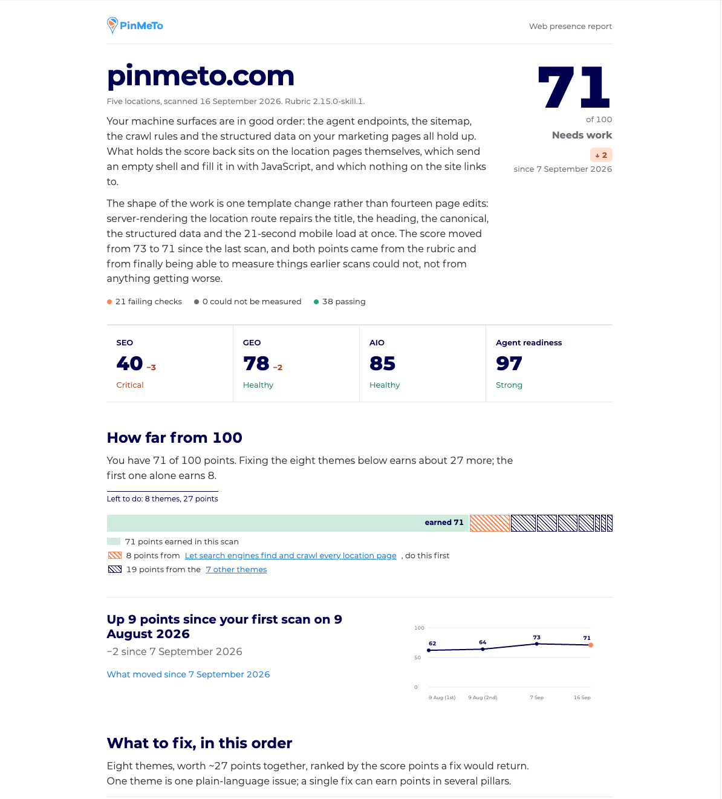

# PinMeTo Web Presence

Your customers are everywhere. Are you?

Web Presence is a skill for Claude that checks how easily a multi-location brand is found
today: in Google search, on Google, Apple and Bing Maps, in AI answers from ChatGPT, Gemini
or Perplexity, and by the AI agents that increasingly shop and book on a customer's behalf.
You ask for a scan, and you get one score, a ranked list of what to fix, and a brief your
developer can act on for each item. Run it again next month and the report shows what moved.



## What the scan looks at

The scan compares your live web presence with the location data you manage in PinMeTo, since
most findability problems come down to the same fact being different in two places: a phone
number on the website that does not match the Google listing, a store page that never made it
into the sitemap, an Apple listing nobody has connected.

It scores four areas.

**Search (SEO).** Your store locator and location pages: can Google crawl them, tell them
apart, read the structured data, and load them quickly on a phone?

**Maps (GEO).** Your real listings on Google, Apple and Bing Maps, read in a browser the way a
customer sees them. Do they exist, are they connected through PinMeTo, and do name, address,
phone, pin and hours agree with your website and with each other?

**AI answers (AIO).** Whether ChatGPT, Claude, Gemini and Perplexity can quote your own pages
when someone asks about you, instead of relying on third-party summaries.

**AI agents (Agent Readiness).** Whether an agent acting for a customer can discover what your
site offers and what it is allowed to do there.

## What you get

A Presence Report written for a marketer, not for a developer. The first page carries the
score out of 100, the four area scores, how far you are from 100 and what fixing each Theme is
worth, and the trend since your first scan.

Below that comes the ranked list of Themes. A Theme is one plain-language issue that one fix
and one owner resolve, such as "Let search engines find and crawl every location page" or
"Same name, address, phone and pin everywhere". Each Theme opens into a brief with the
evidence behind it, the steps to fix it, and a ready-to-paste prompt for your coding agent or
developer. Some Themes are not code at all, such as connecting a listing in PinMeTo.

The full audit sits behind one "Full audit detail" expander for anyone who wants every check
row, every sampled location and the name-address-phone matrix. Every report also carries its
own scan history, so a re-run updates the same report and shows what changed rather than
starting over.

## How to run it

Web Presence ships inside the **PinMeTo Locations** plugin for Claude, alongside Location
Reports. Once the plugin and the PinMeTo Location connection are installed, ask Claude in
plain words:

> Check our web presence for brand.com

or, later:

> Re-run the presence scan for brand.com and show me what changed since 7 September.

The scan reads your location data through PinMeTo, fetches your website, and looks up your
listings on the real map services in a browser. It works on a sample of your locations rather
than all of them, and the report says exactly which ones. You can also ask for a scoped report,
for one country or region, and for a scheduled monthly scan.

## How the scoring works

Every check passes, fails, or is marked "could not be measured" when the scan had no way to
look (a consent wall, no browser). Checks are weighted within their area, and the four areas
are weighted into the overall score: Search 30, Maps 30, AI answers 25, AI agents 15. The
score maps to a grade from A to F.

[The rubric, explained](docs/rubric.md) lists every check with what it looks for, when it
passes, and which Theme it belongs to. It follows the PinMeTo MLPR rubric that PinMeTo's own
reports use, with two adjustments for Maps that the page describes.

## Good to know

The report is generated with AI from automated checks of public signals. It can make
mistakes, so verify a finding before you act on it. It is provided as is, without warranty.
The score points at where visibility can improve; it is not a ranking PinMeTo guarantees.

Map listings are read at a point in time and personalize by viewer, so the report records
the date and what was on screen. A re-run always scores with the current rubric, and the
trend section says whether a change came from your site, from a correction, or from the
rubric itself.

## For developers

The skill is `SKILL.md` plus the `references/` folder, with the deterministic parts of a scan
shipped as scripts in `scripts/` (see `scripts/README.md`). The scoring contract lives in
`references/rubric.md`; `docs/rubric.md` is generated from it. Releases are listed in
`CHANGELOG.md`.

```bash
node --test 'tests/*.test.mjs'       # unit tests
node scripts/check-references.mjs    # do the shipped files agree with each other?
node scripts/render-rubric.mjs       # regenerate docs/rubric.md after a rubric change
```

To release: bump `version:` in `SKILL.md`, add the changelog entry, regenerate `docs/rubric.md`
if the rubric moved, then tag `vX.Y.Z` and push the tag. `release.yml` packages the `.skill`,
publishes a GitHub release and, when the `MARKETPLACE_DISPATCH_TOKEN` secret is configured,
notifies [`PinMeTo/claude-plugins`](https://github.com/PinMeTo/claude-plugins) to vendor the
new version. Without the secret, run the marketplace's "Sync plugin artifacts" workflow by hand.
A rubric change also bumps `rubric_version` in `references/rubric.md`, so re-runs can tell
rubric drift from real progress.

Current version: `v0.16.2` on rubric 2.15.0-skill.1.

## License

Proprietary. © PinMeTo AB. See [LICENSE](LICENSE).
